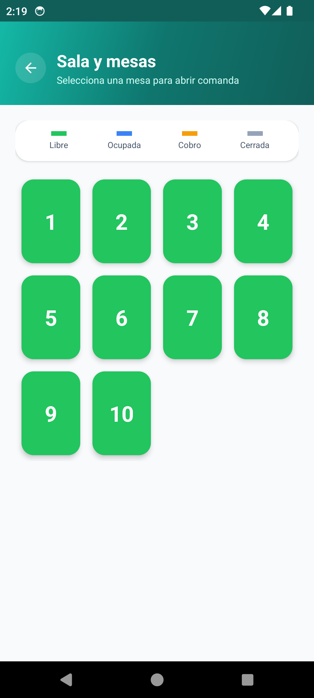
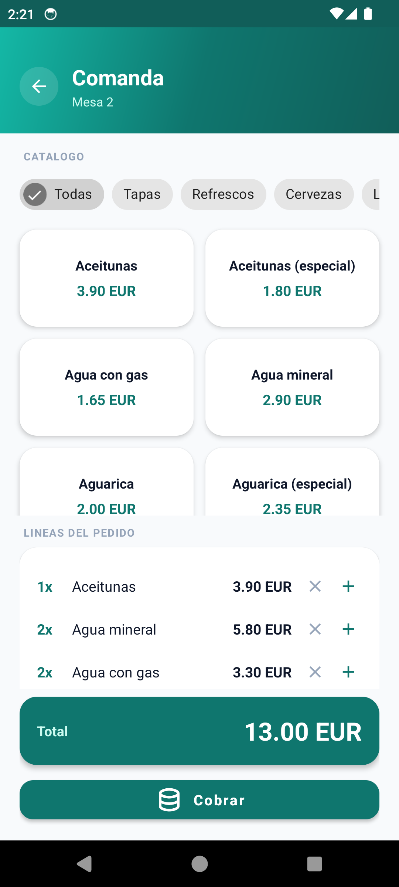
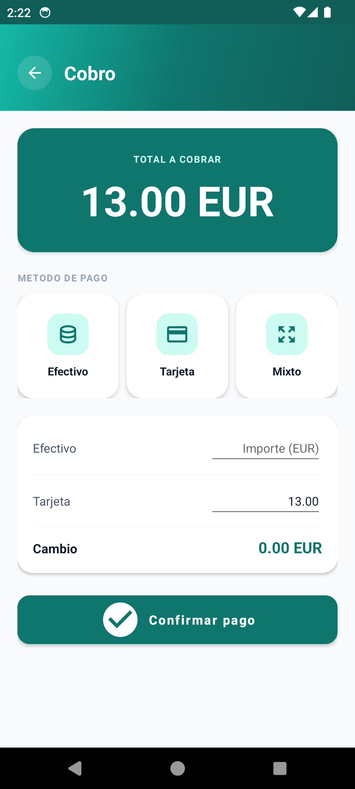
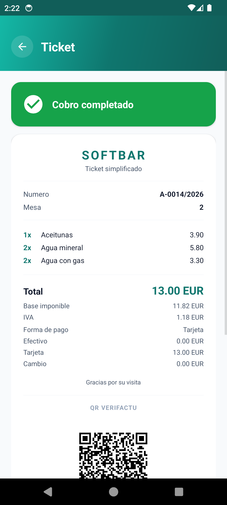
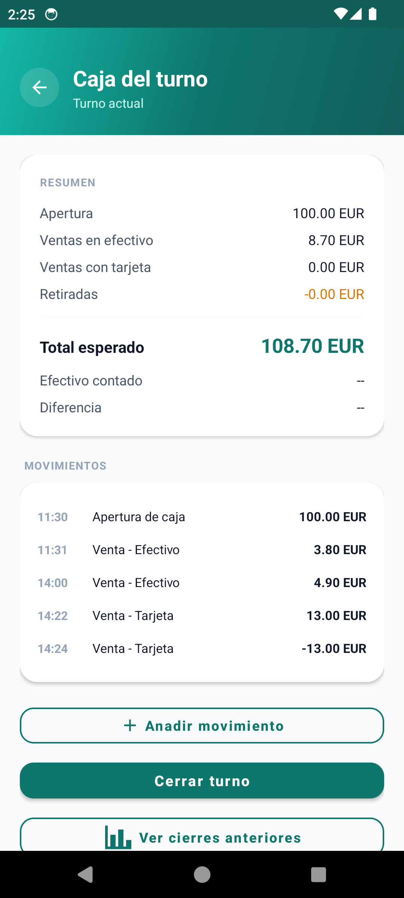
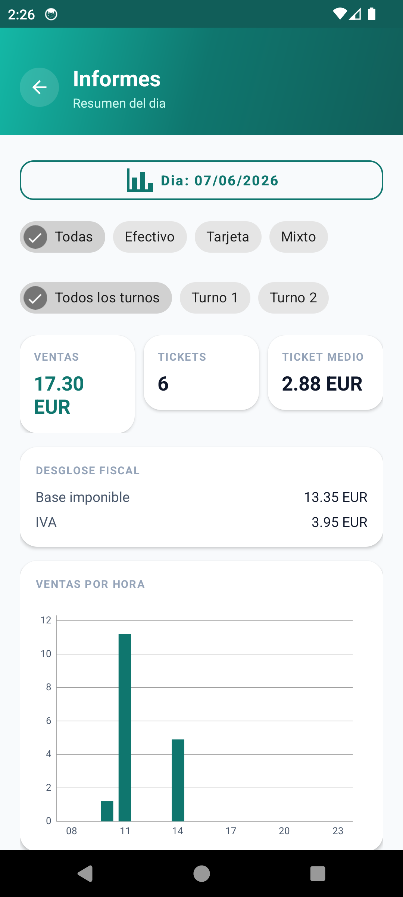
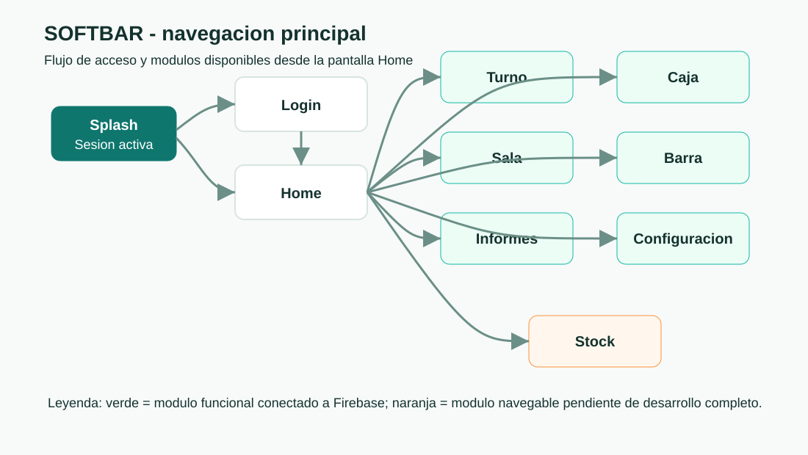
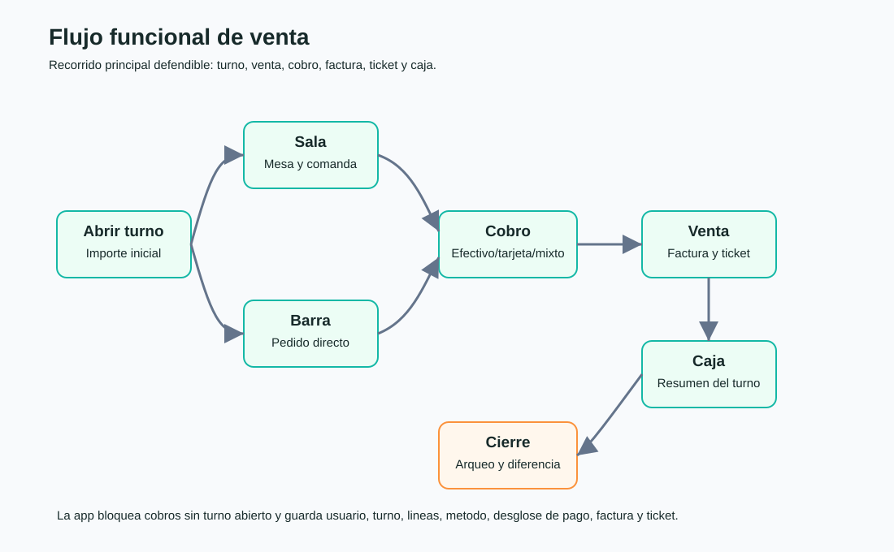
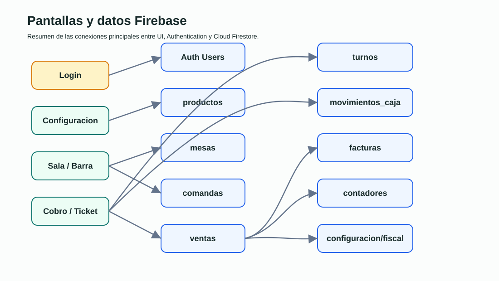

# SOFTBAR

[](https://github.com/Fernand0cm/SOFTBAR_ALE-FER/actions/workflows/ci.yml)

SOFTBAR es una aplicacion Android nativa para un TPV de hosteleria orientado a bares y cafeterias. El objetivo del TFG es demostrar un flujo operativo completo: acceso de usuario, apertura de turno, sala y mesas, barra rapida, comanda, cobro, factura, ticket, caja, informes y configuracion del catalogo.

La app esta conectada a Firebase y mantiene la mayor parte de los datos operativos en Cloud Firestore.

## Estado Actual

Version estable **v1.0.0**, con integracion continua en verde y el flujo
operativo completo funcionando de extremo a extremo.

- Proyecto Android nativo con modulo `app`.
- Java 11, `minSdk 28`, `targetSdk 36` y `compileSdk 36`.
- Interfaz basada en AppCompat y Material Components, con icono de la app propio (logo de SOFTBAR).
- Firebase Authentication para acceso con email y contrasena.
- Cloud Firestore como base de datos principal, con reglas de seguridad endurecidas.
- Persistencia offline de Firestore activada al arrancar la app.
- Reglas e indices Firestore versionados en el repositorio.
- Indicador de conexion y sincronizacion en Home (online / sincronizando / sin conexion).
- Cobro y rectificacion operativos sin conexion: las escrituras se encolan y sincronizan al recuperar red, y la numeracion correlativa se garantiza mediante transacciones y reglas de servidor.
- Roles de usuario (administrador, caja, camarero, cocina) con permisos por modulo en cliente y servidor.
- Catalogo con alta manual o por escaner, IVA por producto, categorias y activacion/desactivacion.
- Comanda avanzada con cantidades, notas y modificadores por linea.
- Stock opcional por producto con descuento automatico al vender y alertas de bajo minimo.
- Facturacion Verifactu: numeracion correlativa, hash SHA-256 encadenado, QR y facturas rectificativas.
- Informes con filtros (fecha, turno, metodo), productos mas vendidos y comparativa por dia.
- Lector de codigos de barras con ML Kit / Google Code Scanner.
- Generacion de QR con ZXing para el bloque Verifactu.
- Graficas de informes con MPAndroidChart.
- Calculo monetario con `BigDecimal` para evitar errores de redondeo.
- 90 pruebas unitarias (JUnit) y 25 pruebas de reglas sobre el emulador de Firestore.
- Integracion continua con GitHub Actions (pruebas unitarias y de reglas en cada cambio).

## Capturas De La App

<table>
  <tr>
    <td align="center"><br><sub>Sala y mesas</sub></td>
    <td align="center"><br><sub>Comanda con modificadores</sub></td>
    <td align="center"><br><sub>Cobro mixto</sub></td>
  </tr>
  <tr>
    <td align="center"><br><sub>Ticket con QR Verifactu</sub></td>
    <td align="center"><br><sub>Caja y arqueo</sub></td>
    <td align="center"><br><sub>Informes</sub></td>
  </tr>
</table>

Mas evidencias en `docs/demo/` y el recorrido completo en `docs/demo/RESULTADO_DEMO.md`.

## Navegacion

### Mapa Principal



### Flujo De Venta



### Pantallas Y Firebase



## Flujo Funcional Principal

El flujo minimo defendible queda asi:

```text
splash -> login -> home -> turno -> sala/barra -> comanda -> cobro -> venta -> factura -> ticket -> caja -> cierre
```

Cada venta queda asociada a:

- Usuario autenticado.
- Turno activo.
- Mesa o barra.
- Lineas vendidas.
- Metodo y desglose de pago.
- Factura generada.
- Ticket visible.

## Modulos Implementados

### Autenticacion Y Arranque

- Splash inicial con sesion activa o redireccion a login.
- Login con Firebase Authentication.
- Cierre de sesion desde Home.
- Email del usuario autenticado visible en la pantalla principal.
- Fondo de splash configurable desde `splash_backgrounds`.

### Home

Home permite entrar a:

- Apertura de turno.
- Sala y mesas.
- Barra rapida.
- Caja.
- Informes.
- Stock.
- Historial de tickets.
- Configuracion.

Tambien muestra el estado de conexion del dispositivo.

### Turnos

- Apertura de turno con importe inicial.
- Registro del usuario, fecha e importe inicial.
- Creacion automatica del movimiento de apertura.
- Bloqueo del cobro si no hay turno abierto.
- Cierre desde Caja con arqueo real.

### Sala Y Mesas

- Coleccion `mesas` en Firestore.
- Siembra inicial de 8 mesas si la coleccion esta vacia.
- Escucha en tiempo real de mesas ordenadas por numero.
- Estados: `libre`, `ocupada`, `cobro`, `cerrada`.
- Enlace de mesa con `comandaActivaId`.
- Al tocar una mesa se abre o recupera su comanda activa.

### Comanda

- Comanda persistida en Firestore.
- Catalogo de productos real cargado desde `productos`.
- Anadir productos desde grid.
- Agrupacion de productos repetidos aumentando cantidad.
- Quitar unidades desde la linea.
- Calculo de total desde lineas reales.
- Paso a Cobro con `comandaId`, mesa y total.

### Barra Rapida

- Venta directa sin mesa.
- Catalogo real desde Firestore.
- Lineas en memoria para pedido puntual.
- Calculo de total.
- Paso a Cobro con lineas reales.
- Generacion posterior de venta, factura y ticket igual que sala.

### Cobro

- Metodos disponibles:
  - Efectivo.
  - Tarjeta.
  - Mixto.
- Entrada real de pago en efectivo y tarjeta.
- Calculo de cambio.
- Validacion de que el importe pagado cubre el total.
- Bloqueo de doble pulsacion durante el guardado.
- Transaccion Firestore para crear venta, factura, contador y liberar mesa.
- Guardado de desglose:
  - `pagoEfectivo`
  - `pagoTarjeta`
  - `importeRecibido`
  - `cambio`

### Ticket Y Facturacion

- Ticket posterior al cobro.
- Carga de la venta y factura exactas por `ventaId` y `facturaId`.
- Visualizacion de:
  - Numero de factura.
  - Mesa, si aplica.
  - Lineas vendidas.
  - Total.
  - Metodo de pago.
  - Desglose efectivo/tarjeta/cambio.
  - QR Verifactu.
  - Hash parcial.
- Botones de imprimir y email presentes como acciones pendientes.

### Caja

- Caja asociada al turno activo.
- Resumen del turno:
  - Apertura.
  - Ventas en efectivo.
  - Ventas con tarjeta.
  - Retiradas.
  - Efectivo esperado.
- Movimientos manuales:
  - Apertura.
  - Entrada.
  - Retirada.
- Cierre de turno con:
  - Efectivo contado.
  - Efectivo esperado.
  - Diferencia de caja.
- Historico del cierre guardado en `turnos`.

### Informes

- Fuente principal: coleccion `ventas`.
- KPIs diarios:
  - Total vendido.
  - Numero de tickets.
  - Ticket medio.
- Grafica de ventas por hora.
- Calculos aislados en `IndicadoresVentas` para pruebas unitarias.

### Configuracion Y Catalogo

- Catalogo de productos en Firestore.
- Alta de producto por escaneo de codigo de barras o de forma manual.
- Dialogo de alta y edicion con nombre, precio, tipo de IVA (10%, 21%, 4%), categoria y control de stock.
- Activacion y desactivacion de productos sin borrarlos del catalogo.
- Guardado usando el codigo de barras (o un codigo manual) como identificador.
- Listado en tiempo real ordenado por nombre.

### Stock

- Control de stock opcional por producto (solo lo contable).
- Descuento automatico de stock al cobrar (nunca baja de 0).
- Reposicion rapida con botones +/- o fijando una cantidad.
- Alertas de productos bajo el minimo.

## Firebase

### Servicios Usados

- Firebase Authentication.
- Cloud Firestore.
- Persistencia offline de Firestore.

No se usan actualmente:

- Firebase Storage.
- Cloud Functions.
- Hosting.
- Crashlytics.
- Analytics.

### Colecciones Principales

- `mesas`: estado operativo de la sala.
- `productos`: catalogo de productos.
- `comandas`: pedidos de mesa abiertos o pagados.
- `ventas`: ventas confirmadas.
- `facturas`: facturas simplificadas con hash y QR.
- `contadores`: numeracion anual y ultimo hash.
- `turnos`: apertura, cierre y arqueo.
- `movimientos_caja`: entradas, retiradas y aperturas.
- `usuarios`: perfil y rol de cada usuario (admin, camarero, caja, cocina).
- `configuracion/fiscal`: NIF/CIF y serie de facturacion.
- `splash_backgrounds`: imagenes opcionales del splash.

Mas detalle en:

- `docs/arquitectura.md`
- `docs/guion_demo.md`
- `docs/auditoria_vistas.md`
- `docs/firebase.md`
- `docs/verifactu.md`
- `firestore.rules`
- `firestore.indexes.json`

## Facturacion Y Verifactu

La app genera una factura simplificada al confirmar cada cobro.

Incluye:

- Numeracion transaccional por anio.
- Serie fiscal configurable.
- NIF/CIF configurable en Firestore.
- Hash SHA-256 encadenado.
- QR de validacion en entorno de pruebas.
- Lineas reales de venta.
- Desglose de pago.

Documento recomendado de configuracion:

```text
configuracion/fiscal
```

Campos:

- `nifEmisor`
- `serie`

Si no existe, se usan valores por defecto para mantener la demo operativa.

## Modelo De Datos

Clases principales:

- `Mesa`
- `Producto`
- `Comanda`
- `LineaComanda`
- `Venta`
- `Turno`
- `MovimientoCaja`
- `ResumenCaja`
- `IndicadoresVentas`
- `EstadoMesaColor`

Clases fiscales:

- `Factura`
- `ConfiguracionFiscal`
- `HashVerifactu`
- `GeneradorQrVerifactu`

## Reglas Firestore

Las reglas actuales:

- Bloquean datos de negocio a usuarios no autenticados.
- Permiten lectura publica solo de `splash_backgrounds`.
- Validan la forma de cada documento por coleccion.
- Hacen inmutables las ventas y las facturas (no admiten update ni delete).
- Bloquean borrados sensibles en mesas, comandas, turnos y productos (se desactivan, no se borran).
- Evitan la escalada de privilegios: un usuario no puede atribuirse otro uid ni cambiarse el rol; la gestion de roles queda reservada al administrador.
- Solo admiten importes en negativo cuando la factura es de tipo rectificativa.

Estas reglas se validan con 25 pruebas sobre el emulador (`firestore-tests/`).

Despliegue:

```bash
firebase deploy --only firestore:rules,firestore:indexes
```

## Pruebas

Comando principal:

```bash
./gradlew testDebugUnitTest
```

En Windows:

```powershell
.\gradlew.bat testDebugUnitTest
```

Cobertura actual (**90 pruebas unitarias**):

- Modelos de datos.
- Estados y colores de mesa.
- Calculo de total de comanda.
- Resumen de caja.
- Desglose de pagos.
- Indicadores de ventas.
- Permisos por rol.
- Tratamiento monetario (`Dinero`).
- Hash Verifactu.
- URL de QR Verifactu.
- Numeracion de factura.
- Configuracion fiscal.

Pruebas de reglas de seguridad (**25 pruebas** sobre el emulador de Firestore):

```bash
cd firestore-tests
npm install
npm test
```

Ambas suites se ejecutan automaticamente en cada cambio mediante GitHub Actions.

Documentacion detallada:

- `docs/tests.md`

## Como Ejecutar La App

1. Abrir el proyecto en Android Studio.
2. Sincronizar Gradle.
3. Confirmar que existe `app/google-services.json`.
4. Configurar Firebase si se usa otro proyecto.
5. Ejecutar el modulo `app` en emulador o dispositivo Android.

## Configuracion Firebase Rapida

```bash
firebase login
firebase use tfg-softba
firebase deploy --only firestore:rules,firestore:indexes
```

Usuario de prueba recomendado:

```text
fer@softbar.com
123456
```

Datos minimos para demo:

- Un turno abierto.
- 3-5 productos en catalogo.
- Una mesa con comanda.
- Una venta de barra.
- Un cierre de caja.

## Estructura Del Proyecto

```text
TFG_SOFTBAR/
|- app/
|  |- src/main/java/com/SOFTBAR_F_A/
|  |  |- data/
|  |  |- data/firebase/
|  |  |- data/repository/
|  |  |- data/verifactu/
|  |  |- ui/
|  |- src/main/res/
|  |- src/test/
|- docs/
|  |- images/
|- firestore-tests/
|- firebase.json
|- firestore.rules
|- firestore.indexes.json
|- build.gradle.kts
|- settings.gradle.kts
|- README.md
```

## Diseno Y Carga Cognitiva

El codigo sigue de forma consciente los principios de carga cognitiva recogidos en
[zakirullin/cognitive-load](https://github.com/zakirullin/cognitive-load): el limite
real a la velocidad de desarrollo no es el numero de lineas, sino cuanta informacion
hay que retener en la mente para entender el codigo. Como la memoria de trabajo solo
maneja unos pocos elementos a la vez, el objetivo es eliminar toda la carga cognitiva
que no sea intrinseca al problema.

Como se aplica en SOFTBAR:

- **Modulos profundos, interfaces simples.** Los repositorios exponen operaciones de
  negocio de alto nivel (por ejemplo, registrar un cobro) que ocultan la complejidad
  de la transaccion de Firestore: pocas funciones, mucha funcionalidad.
- **Logica pura aislada.** Los calculos criticos (dinero, IVA, hash Verifactu,
  numeracion, indicadores) viven en clases sin dependencias de Android, faciles de
  leer y de probar sin levantar infraestructura.
- **Soluciones aburridas y directas.** Se evitan las abstracciones "por si acaso" y las
  capas que solo anaden indireccion sin ocultar complejidad.
- **Pocas dependencias.** Cada dependencia es codigo propio que hay que entender; se
  usan librerias acotadas (ML Kit, ZXing, MPAndroidChart) solo donde aportan valor.
- **Una unica fuente de verdad.** Los nombres de colecciones y campos se centralizan en
  `FirestoreSchema`, sin cadenas magicas repartidas por el codigo.
- **Frameworks como biblioteca, no como arquitectura.** Firebase se usa detras de los
  repositorios, no como esqueleto del que dependa toda la aplicacion.

> "El mejor codigo no es el mas elegante o sofisticado, es el que los desarrolladores
> futuros entienden rapidamente." — Addy Osmani

> "Un poco de copia es mejor que una pequena dependencia." — Rob Pike

## Estado Del Proyecto

El proyecto esta completo en su version **v1.0.0**: el flujo operativo funciona
de extremo a extremo, las funcionalidades previstas estan implementadas, las
pruebas pasan y la integracion continua esta en verde. El conjunto se ha
verificado con una demo completa (`docs/demo/RESULTADO_DEMO.md`).

Funcionalidades implementadas: acceso por roles, turnos y arqueo de caja, sala y
mesas, barra rapida, comanda con notas y modificadores, cobro (efectivo, tarjeta
y mixto), ticket y factura Verifactu con QR, facturas rectificativas, catalogo
con IVA y categorias, stock opcional, e informes con filtros, historial de
tickets y consulta de cierres.

## Trabajo Futuro

- Impresion o exportacion real del ticket (impresora termica o PDF).
- Conexion real con el servicio web de la AEAT mediante certificado de empresa.
- Extender el patron MVVM/repositorio al resto de pantallas (caja, comanda, mesas).
- Introducir una capa de dominio para las reglas de negocio.
- Pruebas instrumentadas de navegacion (Espresso).
- Operacion multi-terminal sincronizada.

## Documentacion

- Memoria y esquemas en Obsidian: `docs/obsidian/` (abrir la carpeta como vault).
- Arquitectura: `docs/arquitectura.md`.
- Facturacion Verifactu: `docs/verifactu.md`.
- Firebase y colecciones: `docs/firebase.md`.
- Pruebas: `docs/tests.md`.
- Guion y resultado de la demo: `docs/guion_demo.md`, `docs/demo/RESULTADO_DEMO.md`.
- Cambios por version: `CHANGELOG.md`.
- Guia de contribucion: `CONTRIBUTING.md`.

## Bibliografia Complementaria

Lecturas y proyectos de referencia que han influido en las decisiones de diseno,
arquitectura, seguridad y calidad de SOFTBAR.

### Diseno de software y carga cognitiva

- [zakirullin/cognitive-load](https://github.com/zakirullin/cognitive-load) — principios de carga cognitiva aplicados en el codigo (modulos profundos, soluciones simples).
- John K. Ousterhout, *A Philosophy of Software Design* (2018) — origen del concepto de modulos profundos con interfaces simples.
- Robert C. Martin, *Clean Code* (2008) — nombres expresivos, funciones pequenas y legibilidad.
- Martin Fowler, *Refactoring* (2.a ed., 2018) — mejora continua del codigo sin cambiar su comportamiento.
- Andrew Hunt y David Thomas, *The Pragmatic Programmer* — ortogonalidad y uso del principio DRY con criterio.

### Java y tratamiento de datos

- Joshua Bloch, *Effective Java* (3.a ed.) — buenas practicas, incluido el uso de `BigDecimal` para importes monetarios.

### Arquitectura y buenas practicas en Android

- [android/architecture-samples](https://github.com/android/architecture-samples) — patrones oficiales MVVM y repositorio.
- [android/nowinandroid](https://github.com/android/nowinandroid) — aplicacion de referencia moderna de Android (Google).
- Guia oficial de arquitectura de apps: <https://developer.android.com/topic/architecture>.

### Firebase y seguridad

- [firebase/quickstart-android](https://github.com/firebase/quickstart-android) — ejemplos oficiales de Authentication y Cloud Firestore.
- [OWASP/owasp-masvs](https://github.com/OWASP/owasp-masvs) — estandar de verificacion de seguridad de aplicaciones moviles.

### Cumplimiento fiscal

- Agencia Estatal de Administracion Tributaria (AEAT) — sistema Verifactu y Real Decreto 1007/2023, base del bloque fiscal del ticket.
