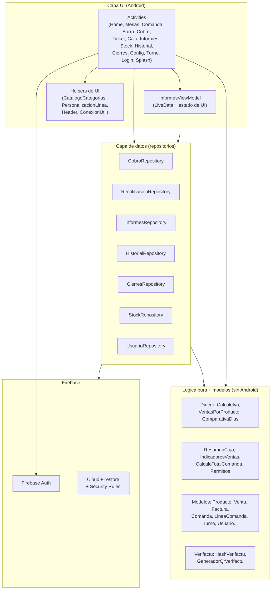
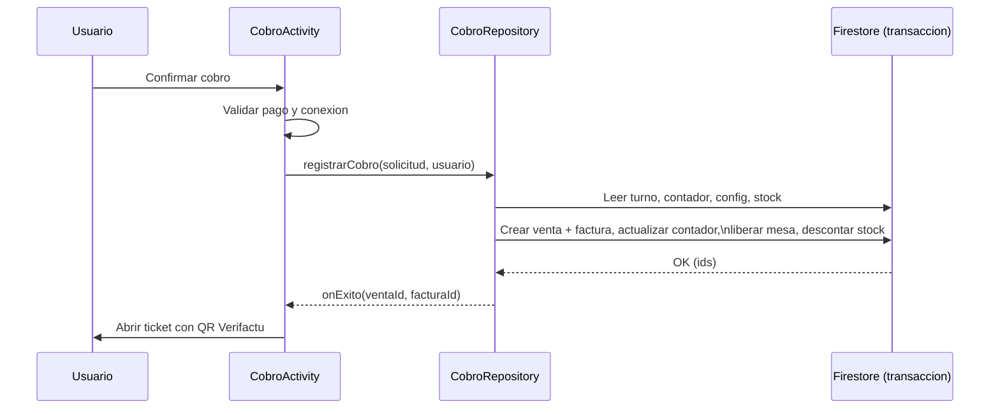

# Arquitectura de SOFTBAR

SOFTBAR es una app Android nativa (Java) sobre Firebase. La arquitectura separa
tres responsabilidades para reducir la carga cognitiva: **UI**, **acceso a
datos (repositorios)** y **logica pura**. La dependencia siempre va hacia abajo;
la logica de negocio pura no depende de Android ni de Firebase, por eso se puede
probar con JUnit.

## Vista por capas

## Principios aplicados

- **Modulos profundos, interfaz simple**: un repositorio esconde operaciones
  complejas tras una llamada sencilla. Por ejemplo, `CobroRepository.registrarCobro(...)`
  encapsula en una transaccion: numeracion fiscal, hash encadenado, calculo de
  IVA, creacion de venta y factura, liberacion de mesa y descuento de stock.
- **Logica pura aislada**: clases como `Dinero`, `CalculoIva`,
  `VentasPorProducto`, `ComparativaDias`, `Permisos` o `ResumenCaja` no dependen
  de Android, lo que permite 80 pruebas unitarias rapidas.
- **Seguridad en el servidor**: las reglas de Firestore validan cada coleccion,
  hacen inmutables ventas/facturas/movimientos, atan los registros a su autor y
  evitan la escalada de privilegios. Verificadas con 25 pruebas sobre el
  emulador.
- **Una sola forma de hacer las cosas**: el acceso a datos pasa por repositorios
  y los nombres de campo por `FirestoreSchema`, evitando *magic strings*.

## Flujo de una venta (resumen)

## Colecciones Firestore

`mesas`, `productos`, `comandas`, `ventas`, `facturas`, `contadores`, `turnos`,
`movimientos_caja`, `usuarios`, `configuracion/fiscal`, `splash_backgrounds`.

Detalle de reglas y modelo en `firestore.rules`, `docs/firebase.md` y
`docs/verifactu.md`.
