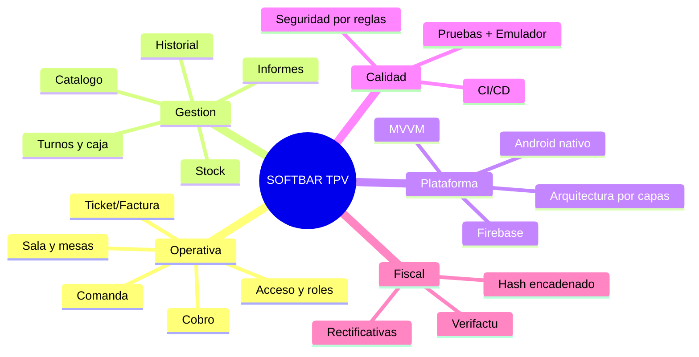

# SOFTBAR · TPV de hostelería — Documentación del TFG

> [!abstract] Resumen ejecutivo
> **SOFTBAR** es un Terminal Punto de Venta (TPV) Android nativo para bares y
> cafeterías, conectado a **Firebase (Auth + Cloud Firestore)**. Cubre el ciclo
> completo: acceso por roles, turno, sala/barra, comanda, cobro, **factura
> Veri*factu** con QR y hash encadenado, caja con arqueo, stock, informes e
> historial. Versión **v1.0.0**, con **CI en verde** y **110 pruebas**
> (85 unitarias + 25 de reglas).

## 🧭 Mapas de contenido (MOC)

## 📚 Memoria del TFG

- [[01 - Introduccion y objetivos]]
- [[02 - Estado del arte y justificacion]]
- [[03 - Metodologia y planificacion]]
- [[04 - Requisitos y casos de uso]]
- [[05 - Arquitectura del sistema]]
- [[06 - Modelo de datos]]
- [[07 - Diseno UI-UX]]
- [[08 - Stack tecnologico]]
- [[09 - Seguridad]]
- [[10 - Facturacion Verifactu]]
- [[11 - Pruebas y CICD]]
- [[12 - Despliegue y operacion]]
- [[13 - Resultados y conclusiones]]
- [[14 - Glosario y bibliografia]]

## 🗺️ Esquemas conceptuales

- [[Esquema - Casos de uso]]
- [[Esquema - Diagrama de clases]]
- [[Esquema - Modelo ER (Firestore)]]
- [[Esquema - Maquinas de estado]]
- [[Esquema - Despliegue]]
- [[Mar de ideas]] · y el lienzo visual `Mar de ideas.canvas`

## 🖥️ Recorrido por la app

- [[Mapa de navegacion]] — diagrama del flujo + registro de errores y capturas
  de cada pantalla.

## 📈 Indicadores del proyecto

| Métrica | Valor |
|---|---|
| Versión | v1.0.0 |
| Pantallas | 14 |
| Colecciones Firestore | 11 |
| Pruebas unitarias | 85 |
| Pruebas de reglas (emulador) | 25 |
| Líneas Java | ~6.700 |
| CI | GitHub Actions (en verde) |

> [!tip] Cómo leer este vault
> Abre la **vista de lectura** (Ctrl/Cmd+E) para ver los diagramas Mermaid y las
> imágenes. Usa la **vista de grafo** para navegar por los enlaces `[[...]]`.
