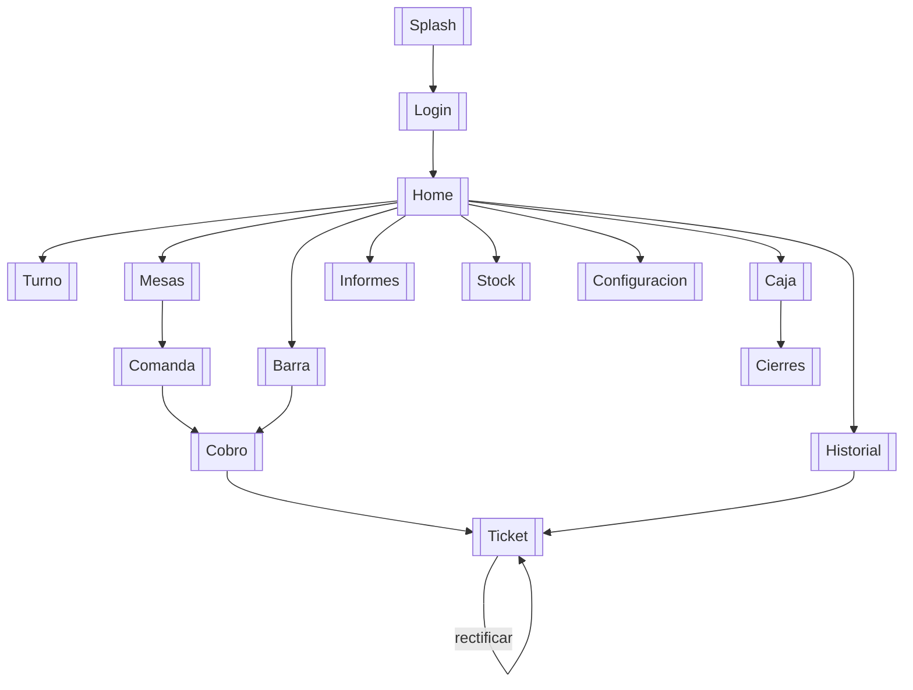

# Mapa de navegacion - SOFTBAR

Vault de Obsidian para registrar el recorrido de la app y llevar el **registro
de errores y correcciones** por pantalla. Cada nota de `pantallas/` lleva su
captura y su tabla de incidencias.

> Capturas tomadas en emulador (Pixel resizable, Android 14) el 2026-06-07 con
> el usuario `fer@softbar.com`. Datos antiguos de prueba (pendiente de ejecutar
> `tools/seed`).

## Recorrido

## Pantallas

- [[Home]]
- [[Login]]
- [[Turno]]
- [[Mesas]]
- [[Comanda]]
- [[Cobro]]
- [[Ticket]]
- [[Barra]]
- [[Caja]]
- [[Cierres]]
- [[Informes]]
- [[Stock]]
- [[Historial]]
- [[Configuracion]]

## Registro global de errores y correcciones

| # | Severidad | Pantallas | Error | Estado | Correccion propuesta |
|---|---|---|---|---|---|
| E1 | Alta | [[Home]], [[Cobro]], [[Ticket]] | La deteccion de conexion da **falso negativo**: con internet real (ping OK a Firestore) la app marca "Sin conexion" y **bloquea el cobro/rectificacion** | Abierto | No bloquear de forma dura por `ConnectivityManager`; comprobar tambien `NET_CAPABILITY_VALIDATED` o intentar la transaccion y gestionar el fallo de Firestore |
| E2 | Media | [[Mesas]] | Datos de prueba antiguos: falta la mesa 2 y varias salen ocupadas sin comanda real | Abierto | Ejecutar `tools/seed` (reinicia mesas y limpia actividad) |
| E3 | Media | [[Comanda]], [[Configuracion]] | Catalogo con ~6 productos antiguos en vez del catalogo real | Abierto | Ejecutar `tools/seed` (~285 productos) |
| E4 | Baja | [[Comanda]], [[Barra]], [[Configuracion]], [[Stock]] | Listas sin `RecyclerView`: posible tiron con cientos de productos | Documentado | Migrar a `RecyclerView` (mejora futura; mitigado filtrando por categoria) |

## Capturas pendientes

- [[Login]]: requiere cerrar sesion (offline no se puede volver a entrar).
- [[Ticket]]: bloqueado por **E1** (el cobro no se completa). Se capturara al
  corregir E1 o en un equipo donde la conexion se detecte bien.
