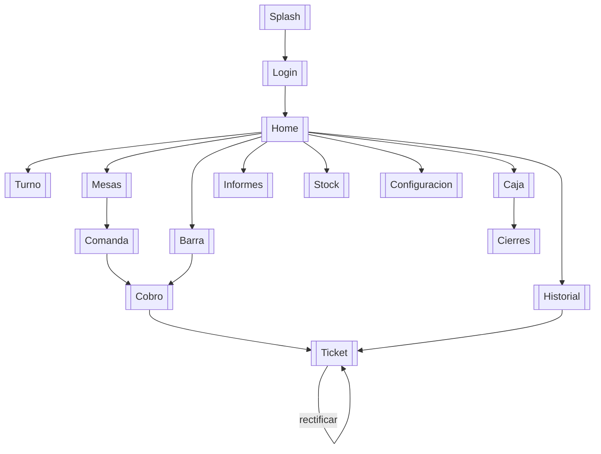

# Mapa de navegacion - SOFTBAR

Vault de Obsidian para registrar el recorrido de la app y llevar el **registro
de errores y correcciones** por pantalla. Cada nota de `pantallas/` lleva su
captura y su tabla de incidencias.

> Capturas tomadas en emulador (Pixel resizable, Android 14) el 2026-06-07 con
> el usuario `fer@softbar.com`. Datos antiguos de prueba (pendiente de ejecutar
> `tools/seed`).

## Recorrido

## Pantallas

- [[Home]]
- [[Login]]
- [[Turno]]
- [[Mesas]]
- [[Comanda]]
- [[Cobro]]
- [[Ticket]]
- [[Barra]]
- [[Caja]]
- [[Cierres]]
- [[Informes]]
- [[Stock]]
- [[Historial]]
- [[Configuracion]]

## Registro global de errores y correcciones

| # | Severidad | Pantallas | Error | Estado | Correccion aplicada |
|---|---|---|---|---|---|
| E1 | Alta | [[Home]], [[Cobro]], [[Ticket]] | La deteccion de conexion daba **falso negativo**: con internet real la app marcaba "Sin conexion" y bloqueaba el cobro/rectificacion | **Resuelto** | Home usa `registerDefaultNetworkCallback`; se quito el bloqueo duro del cobro/rectificacion (la transaccion ya impide numeracion duplicada offline). Verificado: Home "Online" y venta completada (ticket A-0013/2026) |
| E2 | Media | [[Mesas]] | Datos antiguos: faltaba la mesa 2 y varias ocupadas | **Resuelto** | Sembrado en vivo (`firestore-tests/seed-cliente.js`): 10 mesas a "libre". Verificado |
| E3 | Media | [[Comanda]], [[Configuracion]] | Catalogo con ~6 productos antiguos | **Resuelto** | Catalogo antiguo desactivado + 285 productos creados (`seed-cliente.js`). Verificado en comanda/config |
| E4 | Baja | [[Comanda]], [[Barra]], [[Configuracion]], [[Stock]] | Listas sin `RecyclerView`: tiron con cientos de productos y "Cobrar" enterrado bajo el catalogo | **Resuelto** | Catalogo (comanda/barra), Config y Stock migrados a `RecyclerView`; comanda/barra rediseñadas con catalogo que recicla y barra inferior fija. Verificado |

Notas de la correccion:

- Para asignar el primer administrador se desplegaron temporalmente unas reglas
  de bootstrap y luego se restauraron las estrictas (las reglas, correctamente,
  impiden el auto-ascenso de rol).
- Las reglas endurecidas del repo se **desplegaron a produccion** (`tfg-softba`).

## Capturas pendientes

- [[Login]]: requiere cerrar sesion (sin conexion no se puede volver a entrar);
  se capturara en un arranque limpio.
