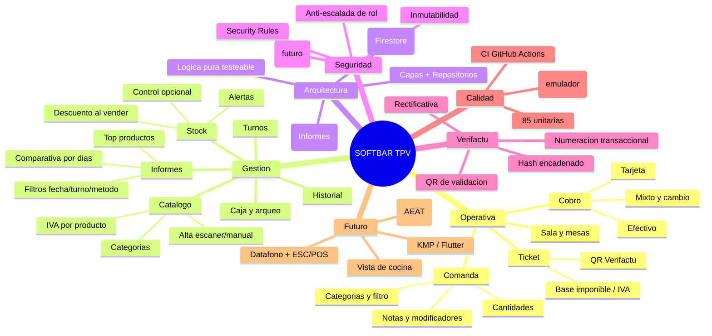

# Mar de ideas

[[Inicio|Índice]] · versión visual: lienzo `Mar de ideas.canvas`

> [!tip] Abre **`Mar de ideas.canvas`** para el tablero visual interactivo.
> Aquí tienes la versión *mindmap* (se ve en modo lectura).

