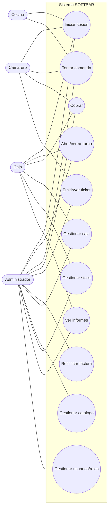

# Esquema — Casos de uso

[[Inicio|Índice]] · relacionado: [[04 - Requisitos y casos de uso]]

> [!note] El acceso a cada caso de uso lo controlan los **permisos por rol**
> (UI) y, en el servidor, las **reglas de Firestore**.
