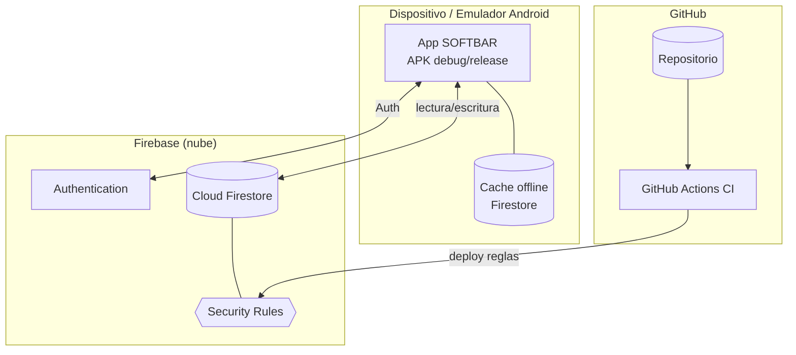

# Esquema — Despliegue

[[Inicio|Índice]] · relacionado: [[12 - Despliegue y operacion]]

> [!tip] El cliente trabaja contra Firestore con **persistencia offline**; las
> **reglas** se versionan en el repo y se despliegan con `firebase deploy`.
