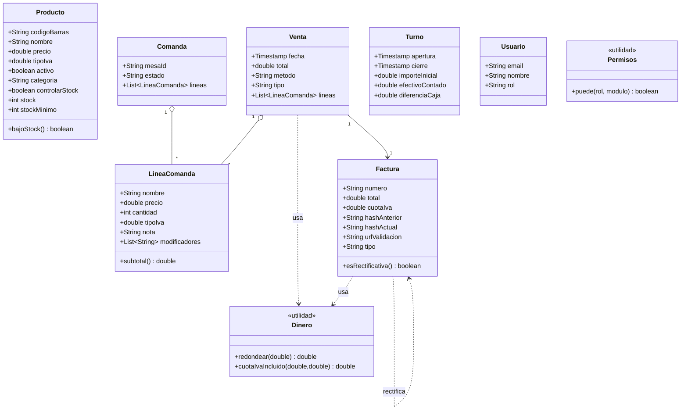

# Esquema — Diagrama de clases (dominio)

[[Inicio|Índice]] · relacionado: [[06 - Modelo de datos]]

Modelo de dominio (POJOs) y lógica pura, sin dependencias de Android.

```mermaid
classDiagram
    class Producto {
      +String codigoBarras
      +String nombre
      +double precio
      +double tipoIva
      +boolean activo
      +String categoria
      +boolean controlarStock
      +int stock
      +int stockMinimo
      +bajoStock() boolean
    }
    class LineaComanda {
      +String nombre
      +double precio
      +int cantidad
      +double tipoIva
      +String nota
      +List~String~ modificadores
      +subtotal() double
    }
    class Comanda {
      +String mesaId
      +String estado
      +List~LineaComanda~ lineas
    }
    class Venta {
      +Timestamp fecha
      +double total
      +String metodo
      +String tipo
      +List~LineaComanda~ lineas
    }
    class Factura {
      +String numero
      +double total
      +double cuotaIva
      +String hashAnterior
      +String hashActual
      +String urlValidacion
      +String tipo
      +esRectificativa() boolean
    }
    class Turno {
      +Timestamp apertura
      +Timestamp cierre
      +double importeInicial
      +double efectivoContado
      +double diferenciaCaja
    }
    class Usuario {
      +String email
      +String nombre
      +String rol
    }
    class Dinero {
      <<utilidad>>
      +redondear(double) double
      +cuotaIvaIncluido(double,double) double
    }
    class Permisos {
      <<utilidad>>
      +puede(rol, modulo) boolean
    }

    Comanda "1" o-- "*" LineaComanda
    Venta "1" o-- "*" LineaComanda
    Venta "1" --> "1" Factura
    Factura ..> Factura : rectifica
    Venta ..> Dinero : usa
    Factura ..> Dinero : usa
```
