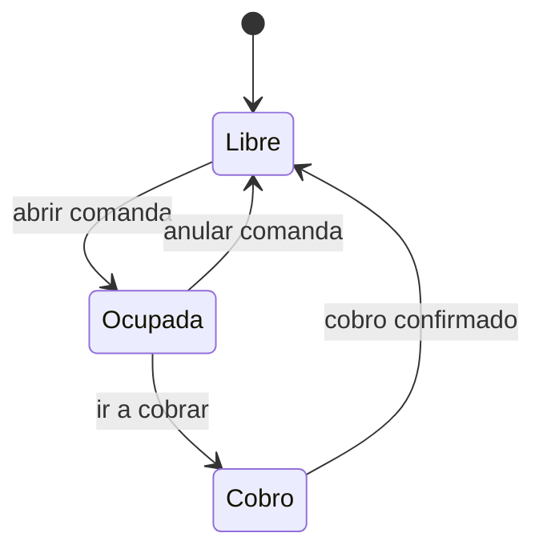
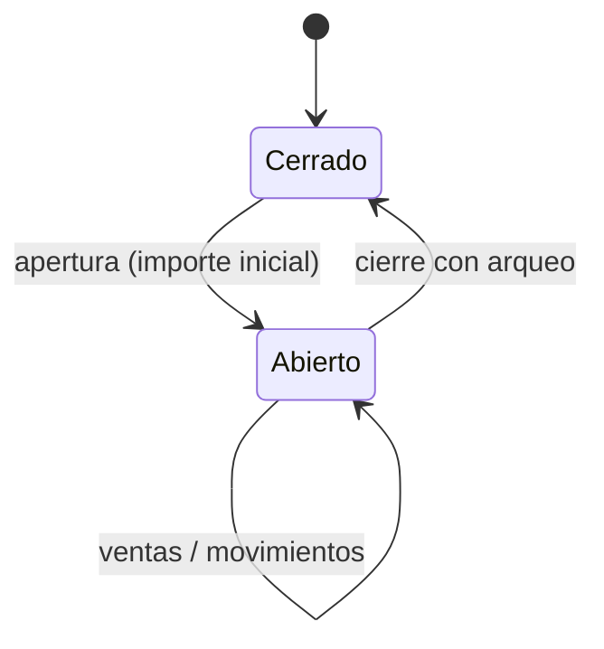
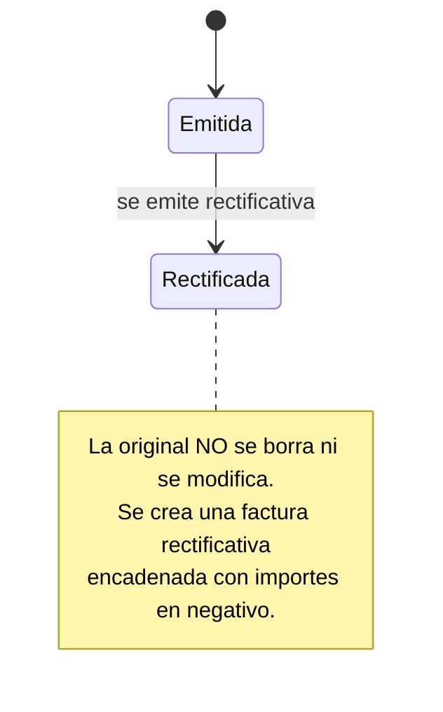

# Esquema — Máquinas de estado

[[Inicio|Índice]]

## Estado de una mesa

```mermaid
stateDiagram-v2
    [*] --> Libre
    Libre --> Ocupada : abrir comanda
    Ocupada --> Cobro : ir a cobrar
    Cobro --> Libre : cobro confirmado
    Ocupada --> Libre : anular comanda
```

## Ciclo del turno

```mermaid
stateDiagram-v2
    [*] --> Cerrado
    Cerrado --> Abierto : apertura (importe inicial)
    Abierto --> Abierto : ventas / movimientos
    Abierto --> Cerrado : cierre con arqueo
```

## Ciclo de una factura

```mermaid
stateDiagram-v2
    [*] --> Emitida
    Emitida --> Rectificada : se emite rectificativa
    note right of Rectificada
      La original NO se borra ni se modifica.
      Se crea una factura rectificativa
      encadenada con importes en negativo.
    end note
```
