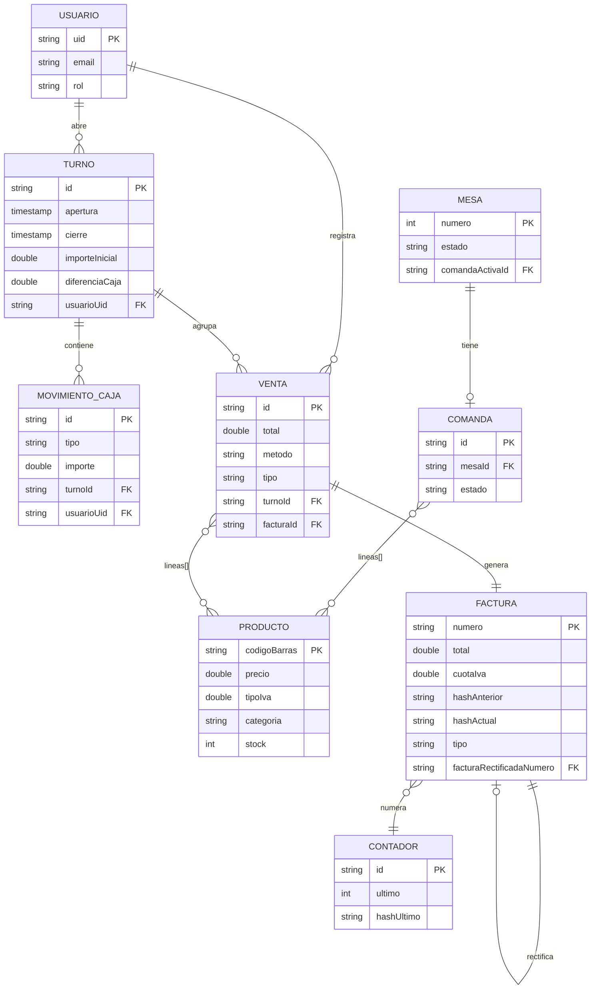

# Esquema — Modelo ER (Firestore)

[[Inicio|Índice]] · relacionado: [[06 - Modelo de datos]]

> [!note] En Firestore las **líneas** se almacenan **embebidas** (array de
> objetos) dentro de comanda/venta/factura; aquí se muestran como relación
> lógica con PRODUCTO para claridad conceptual.
