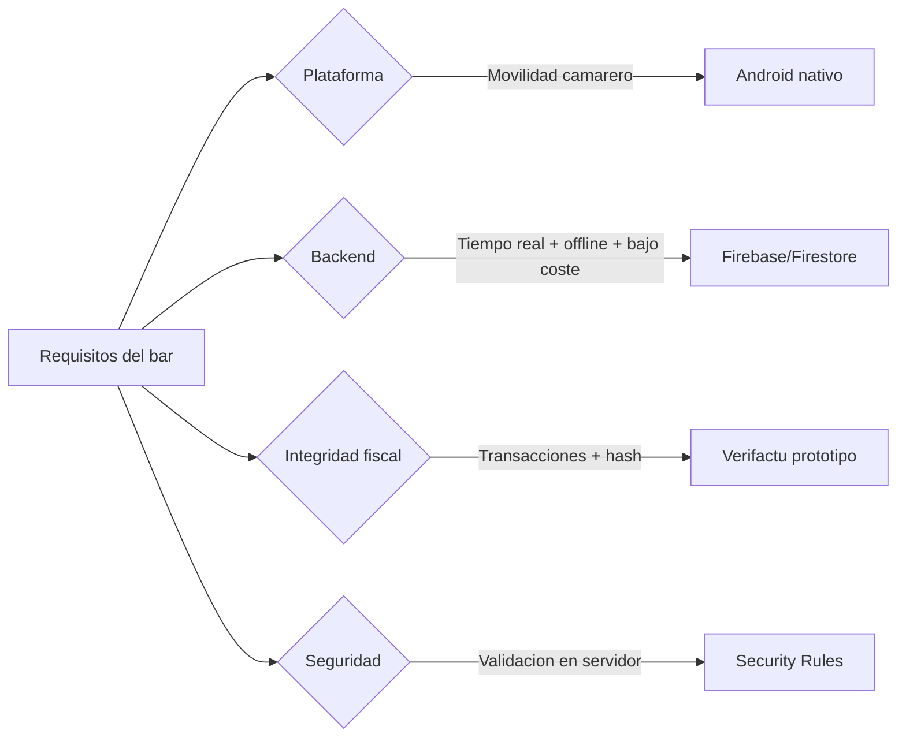

# 2. Estado del arte y justificación

[[01 - Introduccion y objetivos|← Anterior]] · siguiente: [[03 - Metodologia y planificacion]]

## 2.1 Soluciones existentes

| Solución | Modelo | Fortalezas | Debilidades para un bar pequeño |
|---|---|---|---|
| TPV físicos tradicionales | Hardware propietario | Robustez, periféricos | Coste alto, rígidos |
| Glop / ICG / Camarero10 | Software TPV | Completos, soporte | Licencias, complejidad |
| Square / SumUp | TPV + pasarela | Pago integrado | Comisiones, dependencia |
| **SOFTBAR (este TFG)** | App Android + Firebase | Bajo coste, offline, Veri*factu | Prototipo fiscal, sin datáfono |

## 2.2 Marco normativo: Veri*factu

> [!important] Contexto legal
> El Real Decreto 1007/2023 y la normativa **Veri*factu** establecen requisitos
> para los sistemas de facturación: registros **encadenados**, **huella/hash**,
> **QR de verificación** y, opcionalmente, remisión a la AEAT. SOFTBAR implementa
> un **prototipo técnico** de estos conceptos (ver [[10 - Facturacion Verifactu]]),
> documentando con honestidad qué cumple y qué quedaría para producción.

## 2.3 Justificación de las decisiones clave

- **Android nativo (Java):** movilidad del camarero, acceso a cámara (escáner),
  rendimiento y ecosistema maduro.
- **Firebase/Firestore:** sincronización en tiempo real, **persistencia offline**
  integrada, **reglas de seguridad** declarativas y **transacciones** atómicas;
  sin servidor propio que mantener.
- **Veri*factu como prototipo:** demuestra el conocimiento del problema fiscal
  sin sobreprometer cumplimiento legal.

## 2.4 Propuesta de valor

> [!success] Diferenciadores
> - Coste casi nulo de infraestructura (plan Firebase gratuito para un bar).
> - Funciona **sin conexión** y sincroniza al volver la red.
> - **Integridad fiscal** desde el diseño (numeración transaccional + hash).
> - **Seguridad en servidor**: la app no es la única línea de defensa.
