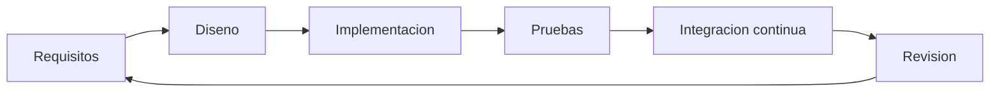
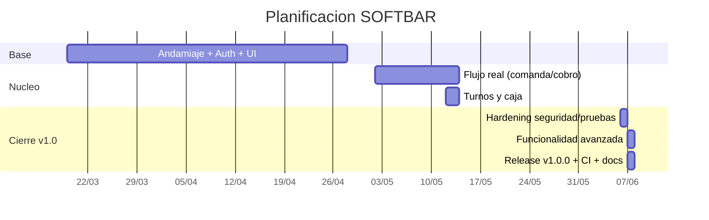

# 3. Metodología y planificación

[[02 - Estado del arte y justificacion|← Anterior]] · siguiente: [[04 - Requisitos y casos de uso]]

## 3.1 Metodología

Desarrollo **iterativo e incremental** por fases funcionales, cada una con su
commit cerrado y verificable. Filosofía de **carga cognitiva mínima** (módulos
profundos con interfaces simples) y **calidad continua** (pruebas + CI).

## 3.2 Herramientas de proceso

| Área | Herramienta |
|---|---|
| Control de versiones | Git + GitHub |
| Integración continua | GitHub Actions |
| Gestión de la documentación | Obsidian (este vault) |
| Pruebas | JUnit + Firebase Emulator Suite |
| IDE | Android Studio |

## 3.3 Planificación temporal

## 3.4 Gestión de riesgos

| Riesgo | Impacto | Mitigación |
|---|---|---|
| Numeración de factura duplicada | Alto | Transacción Firestore + contador monótono |
| Pérdida de datos sin conexión | Medio | Persistencia offline + cobro requiere transacción |
| Escalada de privilegios | Alto | Reglas: sin auto-ascenso de rol |
| Errores de redondeo monetario | Medio | `BigDecimal` y céntimos |
| Demo dependiente del escáner | Bajo | Alta manual de producto |

## 3.5 Control de versiones

Historial **granular** (un commit por capacidad), mensajes en imperativo, rama
`main` **protegida** (exige CI en verde) y **etiqueta `v1.0.0`**. Ver
[[12 - Despliegue y operacion]] y [[11 - Pruebas y CICD]].
