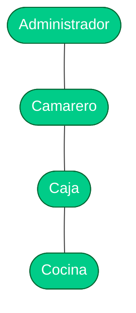

# 4. Análisis de requisitos y casos de uso

[[03 - Metodologia y planificacion|← Anterior]] · siguiente: [[05 - Arquitectura del sistema]]

## 4.1 Requisitos funcionales (RF)

| ID | Requisito | Estado |
|---|---|---|
| RF-01 | Acceso con email/contraseña | ✅ |
| RF-02 | Roles (administrador, camarero, caja, cocina) con permisos por módulo | ✅ |
| RF-03 | Apertura/cierre de turno con importe inicial y arqueo | ✅ |
| RF-04 | Sala con mesas y estados (libre/ocupada/cobro/cerrada) | ✅ |
| RF-05 | Comanda con catálogo, categorías, cantidades, notas y modificadores | ✅ |
| RF-06 | Barra rápida (venta sin mesa) | ✅ |
| RF-07 | Cobro efectivo/tarjeta/mixto con cambio | ✅ |
| RF-08 | Factura simplificada con IVA por tipo, hash y QR | ✅ |
| RF-09 | Rectificación de factura (rectificativa) | ✅ |
| RF-10 | Caja: resumen, movimientos y cierres históricos | ✅ |
| RF-11 | Stock opcional con descuento al vender y alertas | ✅ |
| RF-12 | Catálogo: alta (escáner/manual), edición, desactivación | ✅ |
| RF-13 | Informes con filtros y comparativa por días | ✅ |
| RF-14 | Historial de tickets con reapertura | ✅ |

## 4.2 Requisitos no funcionales (RNF)

> [!note] Calidad
> - **RNF-1 Seguridad:** validación en servidor (reglas), registros inmutables,
>   sin auto-ascenso de rol.
> - **RNF-2 Integridad:** operaciones críticas en **transacción atómica**.
> - **RNF-3 Disponibilidad:** funciona **offline** (persistencia Firestore).
> - **RNF-4 Rendimiento:** listas con `RecyclerView` (cientos de productos).
> - **RNF-5 Precisión monetaria:** `BigDecimal` / céntimos.
> - **RNF-6 Mantenibilidad:** capas + repositorios + pruebas + CI.
> - **RNF-7 Usabilidad:** Material 3, estados de carga/vacío/error.

## 4.3 Actores

- **Administrador:** todo, incluida configuración y gestión de roles.
- **Caja:** turno, caja, informes, stock, ventas.
- **Camarero:** mesas, barra, historial (venta).
- **Cocina:** consulta (mesas/historial).

## 4.4 Casos de uso principales

Ver el diagrama completo en [[Esquema - Casos de uso]].

> [!example] CU-07 “Cobrar comanda” (flujo principal)
> 1. El usuario confirma el cobro y el método de pago.
> 2. El sistema valida el importe y el turno activo.
> 3. En **una transacción**: crea venta y factura, actualiza el contador y el
>    hash, libera la mesa y **descuenta el stock**.
> 4. Muestra el **ticket** con QR Veri*factu.
> 5. *Extensiones:* sin turno → aviso; fallo de red → la transacción no se
>    ejecuta (no hay numeración a medias).
