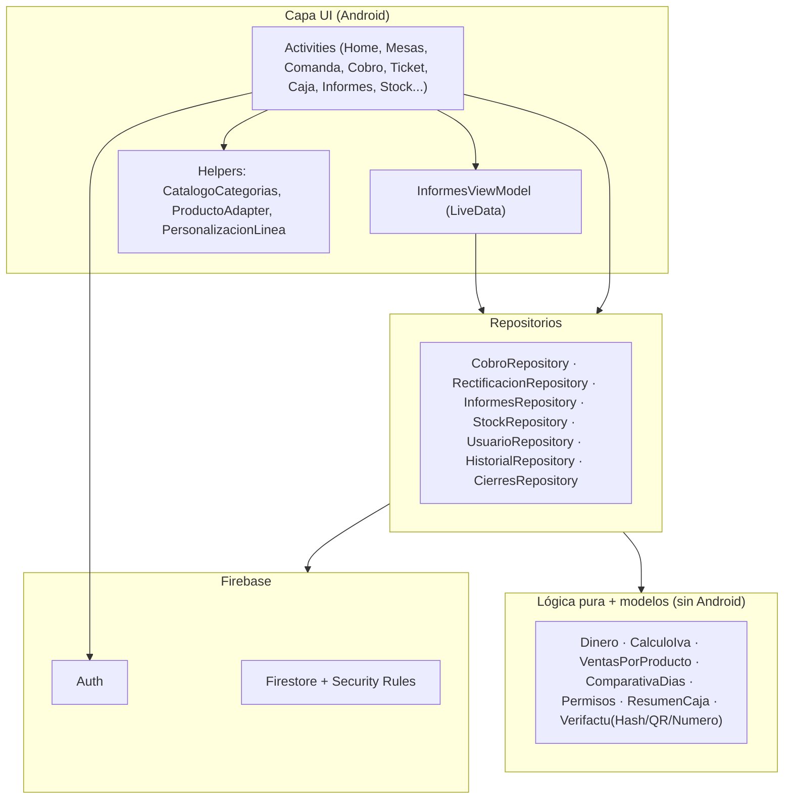
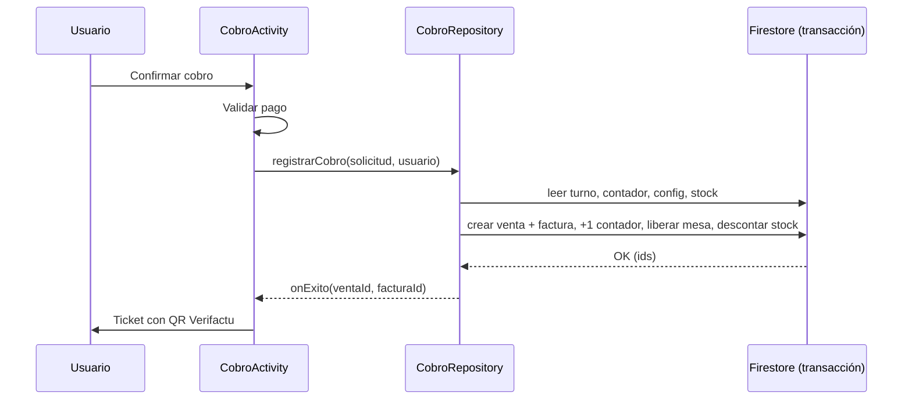

# 5. Arquitectura del sistema

[[04 - Requisitos y casos de uso|← Anterior]] · siguiente: [[06 - Modelo de datos]]

## 5.1 Visión por capas

Separación en **UI**, **repositorios (acceso a datos)** y **lógica pura**. La
dependencia va siempre hacia abajo; la lógica de negocio no depende de Android
ni de Firebase (por eso es testeable con JUnit).

## 5.2 Patrón y principios

- **Repositorio**: aísla Firestore de la UI (interfaz simple, módulo profundo).
- **MVVM** en Informes (`ViewModel` + `LiveData` + estado de UI inmutable).
- **Lógica pura** extraída a clases sin dependencias → 85 pruebas unitarias.
- **`FirestoreSchema`** centraliza nombres de colección/campo (sin *magic strings*).

## 5.3 Flujo de una venta (secuencia)

## 5.4 Modo offline

La persistencia de Firestore permite operar sin red (comandas, mesas, productos,
movimientos se **encolan**). El **cobro y la rectificación** usan **transacción**,
que requiere conexión: así se evita numeración duplicada offline. El indicador de
Home refleja **Online / Sincronizando / Sin conexión**.

## 5.5 Despliegue

Ver [[Esquema - Despliegue]]: app Android (dispositivo/emulador) ↔ Firebase
(Auth, Firestore con reglas) en la nube; CI en GitHub Actions.
