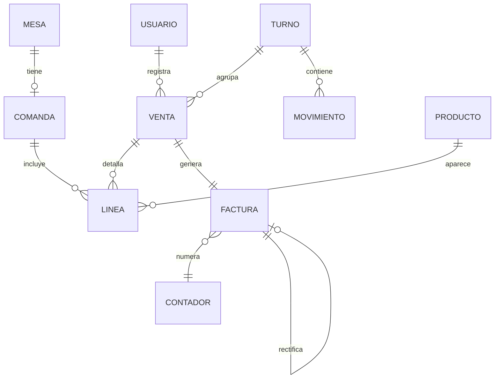

# 6. Modelo de datos

[[05 - Arquitectura del sistema|← Anterior]] · siguiente: [[07 - Diseno UI-UX]]

## 6.1 Colecciones de Firestore

| Colección | Contenido | Inmutable |
|---|---|---|
| `usuarios/{uid}` | email, nombre, rol | rol solo por admin |
| `productos/{codigo}` | nombre, precio, tipoIva, activo, categoria, stock… | no se borra (se desactiva) |
| `mesas/{n}` | numero, estado, comandaActivaId | no se borra |
| `comandas/{id}` | mesaId, estado, lineas[] | no se borra |
| `ventas/{id}` | fecha, total, metodo, lineas[], turnoId, pagos, tipo | **inmutable** |
| `facturas/{num}` | numero, hash, hashAnterior, urlQR, total, cuotaIva, tipo | **inmutable** |
| `contadores/facturas_AAAA` | ultimo, hashUltimo | monótono |
| `turnos/{id}` | apertura, cierre, arqueo, usuario | no se borra |
| `movimientos_caja/{id}` | tipo, importe, turnoId, usuario | **inmutable** |
| `configuracion/fiscal` | nifEmisor, serie | — |

## 6.2 Diagrama entidad-relación (lógico)

Ver versión ampliada en [[Esquema - Modelo ER (Firestore)]].

## 6.3 Modelo de clases (dominio)

Ver [[Esquema - Diagrama de clases]] para el UML completo (POJOs + lógica pura).

## 6.4 Decisiones de diseño de datos

> [!tip] Integridad por diseño
> - **Inmutabilidad** de ventas/facturas/movimientos (las reglas bloquean
>   `update`/`delete`): trazabilidad fiscal.
> - **Numeración transaccional** con contador anual y **hash encadenado**.
> - **No se borra**: productos y mesas se **desactivan/reinician** (rastro).
> - **Líneas embebidas** en comanda/venta/factura (lectura en un solo documento).
> - **Dinero**: se calcula con `BigDecimal` y se persiste redondeado a céntimos.
