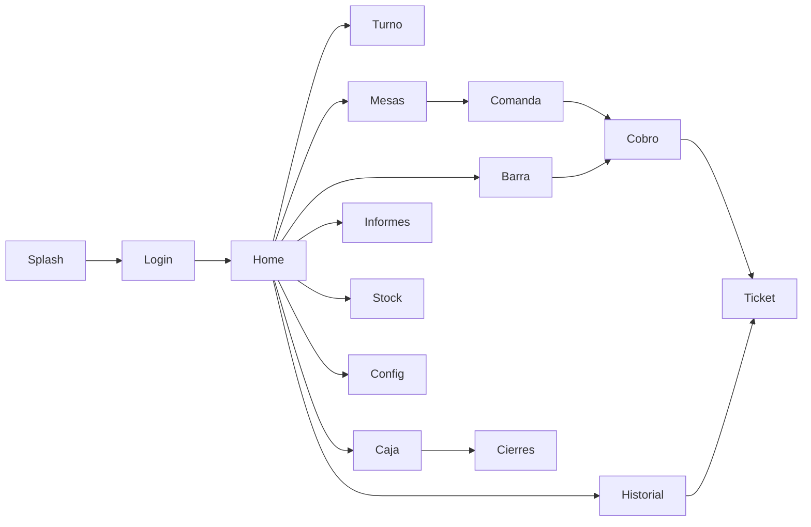

# 7. Diseño UI/UX

[[06 - Modelo de datos|← Anterior]] · siguiente: [[08 - Stack tecnologico]]

## 7.1 Sistema de diseño

- **Material Components / Material 3**: tarjetas, chips, switches, botones.
- Paleta de marca (verde corporativo) y modo claro; tipografía y *eyebrows*.
- **Estados de UI** consistentes: carga, vacío y error (p. ej. en Informes,
  Historial, Stock).

## 7.2 Navegación

Recorrido completo y capturas reales de cada pantalla en [[Mapa de navegacion]].

## 7.3 Decisiones de UX destacables

> [!tip] Pensado para el servicio en barra
> - **Catálogo con filtro por categorías** (chips) y rejilla que **recicla**
>   (`RecyclerView`): fluido con ~285 productos.
> - **Botón Cobrar siempre visible** (no enterrado bajo el catálogo).
> - **Personalización de línea** (modificadores + nota) sin salir de la comanda.
> - **Confirmaciones** antes de acciones sensibles (cierre de turno/sesión).
> - **Indicador de conexión/sincronización** en Home.

## 7.4 Accesibilidad y robustez

- Áreas táctiles amplias, contraste de marca, textos de estado claros.
- `isFinishing()/isDestroyed()` y liberación de *listeners* para evitar fugas.

## 7.5 Capturas

Todas las pantallas están documentadas con captura real en [[Mapa de navegacion]]
y la demo completa con evidencias en `docs/demo/RESULTADO_DEMO.md`.
