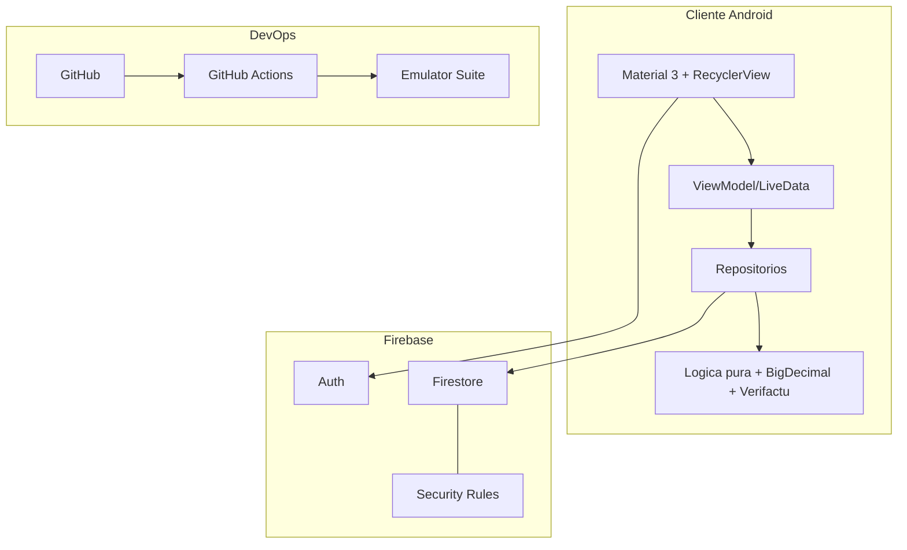

# 8. Stack tecnológico

[[07 - Diseno UI-UX|← Anterior]] · siguiente: [[09 - Seguridad]]

> [!abstract] Resumen
> Android nativo (Java 11) + Firebase (Auth, Firestore), arquitectura por capas
> con MVVM, pruebas con JUnit y **Firebase Emulator Suite**, CI con **GitHub
> Actions**, e ideas Veri*factu (hash SHA‑256 + QR). Versionado con SemVer.

## 8.1 Tecnologías empleadas y por qué

| Tecnología | Uso en SOFTBAR | Por qué impresiona / aporta |
|---|---|---|
| **Android nativo (Java)** | App TPV | Rendimiento, cámara/escáner, ecosistema |
| **Material Components 3** | UI | Diseño moderno y accesible |
| **AndroidX Lifecycle (ViewModel/LiveData)** | MVVM en Informes | Estado reactivo, sobrevive a rotación |
| **RecyclerView** | Catálogo, config, stock | Reciclaje de vistas (rendimiento) |
| **Firebase Authentication** | Acceso | Gestión de identidades sin backend |
| **Cloud Firestore** | BBDD tiempo real | Sync, **offline**, **transacciones** |
| **Firestore Security Rules** | Autorización | **Seguridad en servidor**, no solo en app |
| **Firebase Emulator Suite** | Tests de reglas | Verificación de seguridad automatizada |
| **Transacciones Firestore** | Cobro/rectificación | Atomicidad e integridad fiscal |
| **SHA‑256 + ZXing (QR)** | Veri*factu | Huella encadenada y QR de validación |
| **ML Kit / Google Code Scanner** | Alta de productos | Lectura de códigos de barras |
| **MPAndroidChart** | Informes | Gráficas de ventas |
| **BigDecimal** | Cálculo monetario | Sin errores de coma flotante |
| **JUnit** | Pruebas unitarias | Lógica pura testeada (85) |
| **GitHub Actions (CI)** | Integración continua | Calidad continua, sello profesional |
| **Git + SemVer + ramas protegidas** | Proceso | Trazabilidad y madurez |

## 8.2 Diagrama del stack

## 8.3 Tecnologías de futuro (roadmap técnico)

> [!info] Evolución profesional
> - **Firebase App Check** (anti‑abuso de la API key).
> - **Kotlin Multiplatform / Compose Multiplatform** o **Flutter** (verdadera
>   multiplataforma reutilizando la lógica de dominio).
> - **Cloud Functions** para la huella/firma y el envío a la AEAT.
> - **Integración con datáfono/Redsys** y **impresión ESC/POS**.
> - **Jetpack Compose** para una UI declarativa.
