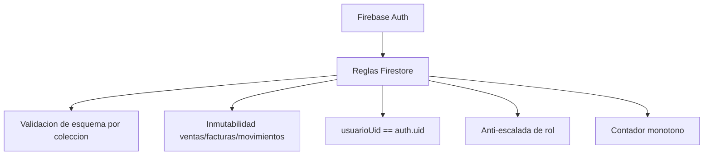

# 9. Seguridad

[[08 - Stack tecnologico|← Anterior]] · siguiente: [[10 - Facturacion Verifactu]]

> [!warning] Principio rector
> La app **no** es la única línea de defensa: la autorización se valida en el
> **servidor** mediante **Firestore Security Rules**, verificadas con pruebas.

## 9.1 Capas de seguridad

## 9.2 Controles implementados

| Control | Descripción |
|---|---|
| Autenticación | Firebase Auth (email/contraseña) |
| Autorización por rol | UI gateada + reglas; **admin** asigna roles |
| Anti‑escalada | Un usuario **no** puede cambiarse el rol; solo un admin |
| Inmutabilidad | `ventas`, `facturas`, `movimientos` no admiten `update`/`delete` |
| Autoría | `usuarioUid == request.auth.uid` en ventas/turnos/movimientos |
| Numeración | Contador **monótono** (solo puede aumentar) |
| Validación de datos | `validProducto`, `validVenta`, `validFactura`… (tipos y rangos) |
| Borrado controlado | Productos/mesas no se borran (se desactivan/reinician) |

## 9.3 Verificación automatizada

25 pruebas sobre el **emulador de Firestore** comprueban, entre otras: lectura
denegada sin sesión, venta ajena rechazada, inmutabilidad, contador monótono,
auto‑registro como camarero permitido, **auto‑ascenso a admin denegado** y
gestión de roles por admin. Ver [[11 - Pruebas y CICD]].

## 9.4 Riesgos residuales y mejoras

> [!caution] Pendiente para producción
> - **Firebase App Check** para impedir uso de la API key por apps no
>   autorizadas.
> - Restricción de la API key por SHA de la app.
> - Contraseñas fuertes (la de demo `123456` es solo para pruebas).
