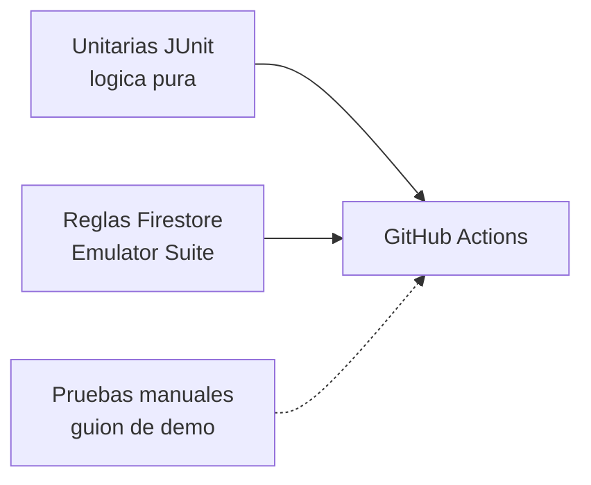
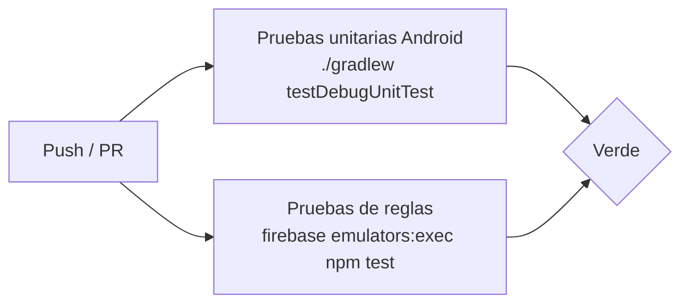

# 11. Pruebas y CI/CD

[[10 - Facturacion Verifactu|← Anterior]] · siguiente: [[12 - Despliegue y operacion]]

## 11.1 Estrategia de pruebas



- **Unitarias (85):** `Dinero`, `CalculoIva`, `VentasPorProducto`,
  `ComparativaDias`, `Permisos`, `ResumenCaja`, `IndicadoresVentas`,
  `HashVerifactu`, `NumeroFactura`, modelos…
- **Reglas (25):** sobre el **emulador**: accesos, inmutabilidad, contador
  monótono, anti‑escalada de rol, validación de productos/ventas/facturas.
- **Manuales:** guion de demo reproducible (`docs/guion_demo.md`).

## 11.2 Cobertura de la lógica crítica

| Área | Cubierta por |
|---|---|
| Dinero / redondeo | `DineroTest` |
| IVA por tipo | `CalculoIvaTest` |
| Numeración de factura | `NumeroFacturaTest` |
| Hash encadenado | `HashVerifactuTest` |
| Permisos por rol | `PermisosTest` |
| Caja / arqueo | `ResumenCajaTest` |
| Informes | `IndicadoresVentasTest`, `VentasPorProductoTest`, `ComparativaDiasTest` |

## 11.3 Integración continua

`.github/workflows/ci.yml` con dos *jobs* en cada push/PR:



- Rama `main` **protegida**: exige ambos *checks* en verde.
- Badge de estado en el `README`.

## 11.4 Cómo ejecutar

```bash
./gradlew testDebugUnitTest          # unitarias
cd firestore-tests && npm ci && npm test   # reglas (emulador)
```
