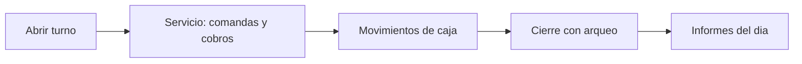

# 12. Despliegue y operación

[[11 - Pruebas y CICD|← Anterior]] · siguiente: [[13 - Resultados y conclusiones]]

## 12.1 Topología de despliegue

Ver [[Esquema - Despliegue]].

## 12.2 Puesta en marcha (app)

1. Abrir el proyecto en Android Studio (JDK 17, Android SDK).
2. Confirmar `app/google-services.json` del proyecto Firebase.
3. Ejecutar el módulo `app` en emulador/dispositivo.

## 12.3 Reglas e índices Firestore

```bash
firebase deploy --only firestore:rules,firestore:indexes --project tfg-softba
```

> [!note] Las reglas endurecidas están **desplegadas en producción** y
> versionadas en `firestore.rules`.

## 12.4 Datos de demo (capturas/defensa)

- **Admin SDK** (recomendado): `tools/seed/` con `serviceAccount.json` →
  `npm run seed` (borra actividad y crea ~285 productos, mesas, config, admin).
- **Cliente** (sin service account): `firestore-tests/seed-cliente.js` (usa el
  usuario de demo; desactiva el catálogo viejo y crea el nuevo).

## 12.5 Versionado y release

- **Git** con historial granular; rama `main` protegida (CI obligatoria).
- **SemVer**: etiqueta **`v1.0.0`**; `CHANGELOG.md` con el detalle.
- `CONTRIBUTING.md` y plantilla de Pull Request.

## 12.6 Operación diaria (negocio)


